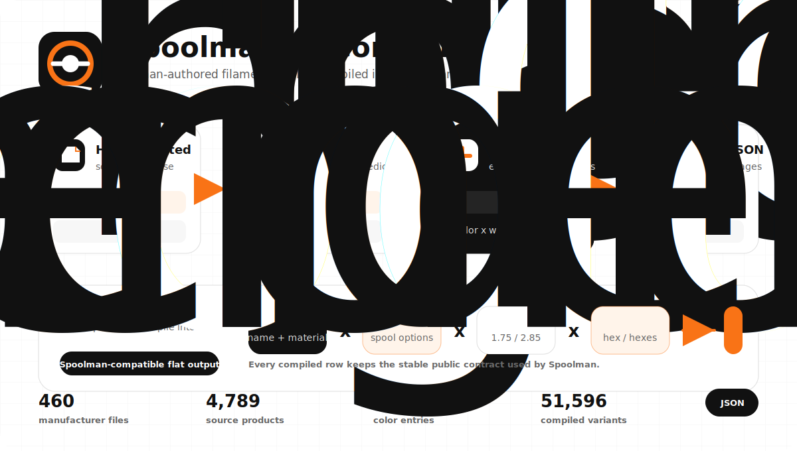

<h1 align="center">SpoolmanDB Community</h1>

<p align="center">
  Community-maintained filament and materials data for 3D printing.
</p>

<p align="center">
  <a href="https://github.com/Icezaza2543/SpoolmanDB-Community/actions/workflows/build.yml"></a>
  <a href="https://icezaza2543.github.io/SpoolmanDB-Community/"></a>
  <a href="LICENSE"></a>
  <a href="CONTRIBUTING.md"></a>
  <a href="https://github.com/Donkie/SpoolmanDB"></a>
</p>

<p align="center">
  <code>filaments.json</code> | <code>materials.json</code> | schema-validated source data
</p>

---

## What this is

SpoolmanDB Community is a community-maintained continuation of [Donkie/SpoolmanDB](https://github.com/Donkie/SpoolmanDB). It keeps the original project history, attribution, and MIT license while keeping the filament database reviewed, validated, and available while upstream maintenance is quiet.

The goal is boring in the best way: current filament data, predictable JSON, repeatable validation, and small pull requests that are easy to review.

## Live data

| Resource | Link |
| --- | --- |
| Browse the database | <https://icezaza2543.github.io/SpoolmanDB-Community/> |
| Compiled filament data | <https://icezaza2543.github.io/SpoolmanDB-Community/filaments.json> |
| Material defaults | <https://icezaza2543.github.io/SpoolmanDB-Community/materials.json> |
| Contributing guide | [CONTRIBUTING.md](CONTRIBUTING.md) |
| Upstream project | [Donkie/SpoolmanDB](https://github.com/Donkie/SpoolmanDB) |

## Current snapshot

| Source | Count |
| --- | ---: |
| Manufacturer source files | 75 |
| Material definitions | 34 |
| Source filament objects | 540 |
| Color entries | 4,608 |
| Compiled filament variants | 8,900 |

Counts are generated from the current repository state. The compiled variant count expands source data across color, diameter, weight, and spool combinations.

## Data model at a glance

<picture>
  <source media="(prefers-color-scheme: dark)" srcset="docs/assets/data-model-dark.svg">
  
</picture>

Source files stay small enough to review by hand. The compiler validates and expands them into the flat JSON contract consumed by Spoolman.

## Repository layout

```text
filaments/                 Manufacturer source JSON files
materials.json             Shared material defaults
filaments.schema.json      Schema for manufacturer source files
materials.schema.json      Schema for material defaults
scripts/compile_filaments.py
public/                    GitHub Pages shell and deployed data target
```

<picture>
  <source media="(prefers-color-scheme: dark)" srcset="docs/assets/repository-layout-dark.svg">
  
</picture>

## Contributor workflow

1. Add or edit manufacturer source files in `filaments/`.
2. Keep the pull request focused: one manufacturer, one correction set, or one schema change.
3. Link manufacturer product pages, datasheets, SDS/TDS files, or other evidence.
4. Run validation locally before opening a pull request.

```powershell
python scripts/compile_filaments.py
check-jsonschema --schemafile materials.schema.json materials.json
check-jsonschema --schemafile filaments.schema.json filaments/*
```

If `check-jsonschema` is not installed:

```powershell
python -m pip install check-jsonschema
```

## Data model

The source files in `filaments/` are intentionally compact. Deployment expands them into one generated `filaments.json` file. If a source entry has two diameters, two spool weights, and five colors, it becomes twenty compiled filament variants.

<details>
<summary>Filament source fields</summary>

| Field | Required | Notes |
| --- | --- | --- |
| `name` | yes | Product name. Usually contains `{color_name}` so each color expands into a readable compiled name. |
| `material` | yes | Material name, such as `PLA`, `PETG`, `ABS`, `TPU-95A`, or schema-supported composites. |
| `density` | yes | Material density in g/cm3. |
| `weights` | yes | Array of `weight`, optional `spool_weight`, and optional `spool_type`. |
| `diameters` | yes | Filament diameters in mm, commonly `1.75` or `2.85`. |
| `colors` | yes | Color objects with `name` plus either `hex` or `hexes`. |
| `extruder_temp` | optional | Recommended extruder temperature in degrees Celsius. |
| `extruder_temp_range` | optional | Two-value temperature range, such as `[190, 230]`. |
| `bed_temp` | optional | Recommended bed temperature in degrees Celsius. |
| `bed_temp_range` | optional | Two-value bed temperature range. |
| `finish` | optional | `matte` or `glossy`; only set when the product is designed that way. |
| `multi_color_direction` | optional | `coaxial` for split/side-by-side colors or `longitudinal` for color changes along the filament length. |
| `pattern` | optional | Currently `marble` or `sparkle`. |
| `translucent` | optional | Boolean for partially see-through filament. |
| `glow` | optional | Boolean for glow-in-the-dark filament. |
| `country_of_origin` | optional | Manufacturing country. |
| `sds_url` | optional | Safety Data Sheet URL. |
| `tds_url` | optional | Technical Data Sheet URL. |

Color entries can override `finish`, `multi_color_direction`, `pattern`, `translucent`, and `glow` when a specific color differs from the product default. They can also include `codes`, `eans`, and `eans_refill` arrays for manufacturer SKUs and spooled/refill EAN or GTIN barcodes.

</details>

<details>
<summary>Material source fields</summary>

All shared material defaults live in `materials.json`.

| Field | Required | Notes |
| --- | --- | --- |
| `material` | yes | Material name, such as `PLA`. |
| `density` | yes | Density in g/cm3. |
| `extruder_temp` | optional | General extruder temperature. |
| `bed_temp` | optional | General bed temperature. |

</details>

## Maintenance stance

This fork exists to keep the data usable while upstream is inactive. If upstream maintainership resumes, changes here can be proposed back to the original project. Until then, this repository favors small reviewed data updates, source-backed corrections, schema validation, and GitHub Pages deployment that stays green.

## License

This project preserves the upstream MIT license. See [LICENSE](LICENSE).
