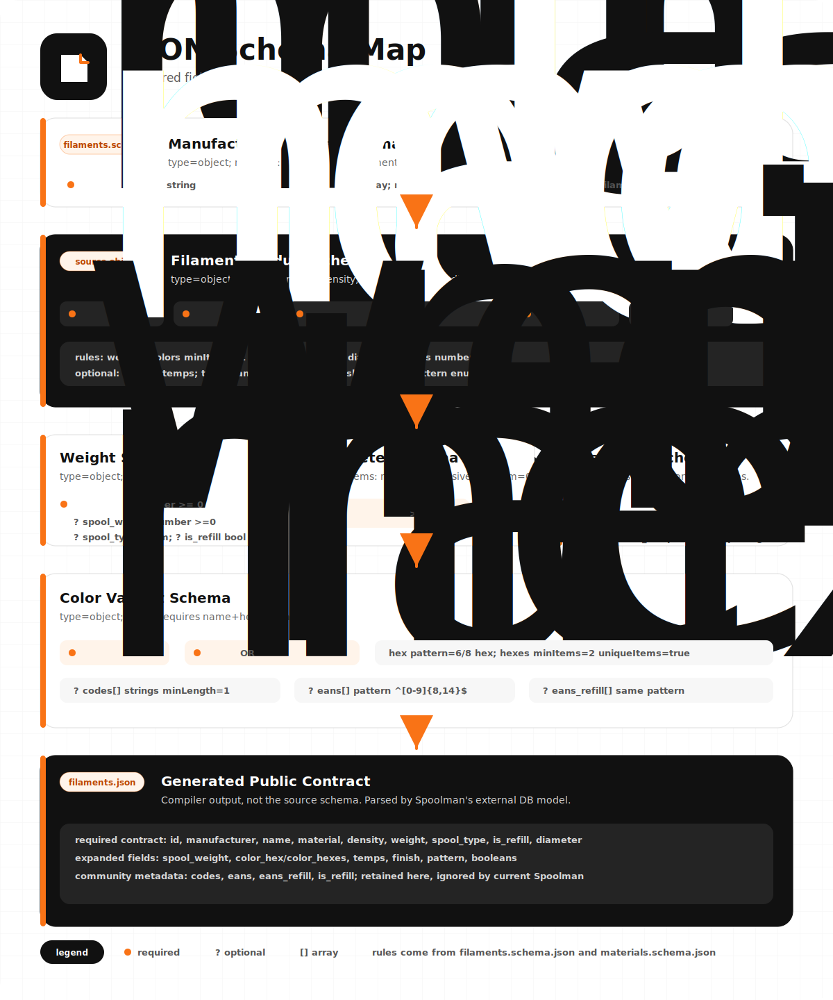

<h1 align="center">SpoolmanDB Community</h1>

<p align="center">
  Community-maintained filament and materials data for 3D printing.
</p>

<p align="center">
  <a href="https://github.com/Icezaza2543/SpoolmanDB-Community/actions/workflows/build.yml"></a>
  <a href="https://icezaza2543.github.io/SpoolmanDB-Community/"></a>
  <a href="LICENSE"></a>
  <a href="TERMS.md"></a>
  <a href="POLICY.md"></a>
  <a href="CONTRIBUTING.md"></a>
  <a href="https://github.com/Donkie/SpoolmanDB"></a>
</p>

<p align="center">
  <code>filaments.json</code> | <code>materials.json</code> | schema-validated source data
</p>

---

## What this is

SpoolmanDB Community is a community-maintained continuation of [Donkie/SpoolmanDB](https://github.com/Donkie/SpoolmanDB). It keeps the original project history, attribution, and MIT license while keeping the filament database reviewed, validated, and available while upstream maintenance is quiet.

The goal is boring in the best way: current filament data, predictable JSON, repeatable validation, and small pull requests that are easy to review.

## Key Enhancements & Differences from Upstream

SpoolmanDB Community introduces several structural, validation, and metadata improvements over the original `Donkie/SpoolmanDB` project:

*   **Native & Strict Quality Controls**:
    *   **Unified Validation**: Uses a native Python validation script ([validate.py](scripts/validate.py)) powered by `jsonschema` instead of relying on external CLI tools.
    *   **Rigid Compiler Checks**: A compiled schema ([filaments.compiled.schema.json](filaments.compiled.schema.json)) strictly validates the final compiled database to prevent broken data structures, bad IDs, or invalid formats from shipping.
    *   **Unit Test Suite**: Includes automated compiler unit testing using `pytest` ([test_compile.py](tests/test_compile.py)) to safeguard ID normalization, multi-color constraints, and manufacturer duplicate checks.
*   **Editor Experience**:
    *   Workspace configurations ([settings.json](.vscode/settings.json)) bind schemas to JSON files in the IDE, offering real-time diagnostics, autocomplete, and inline linting.
*   **Expanded Data & Metadata**:
    *   **Additional Metadata**: Full compiler passthrough for source-backed fields including `country_of_origin`, `sds_url`, `tds_url`, `codes`, `eans`, and `eans_refill` from source profiles to the final database.
    *   **Modern Materials**: Added missing material definitions in [materials.json](materials.json) (`BVOH`, `CoPE`, `PP`, `PAHT`, `PPA`, `PPS`, `PET`).
    *   **Massive Brand Updates**: Expanded to **460 manufacturer source files**, covering popular consumer, local, industrial, and community brands such as Bambu Lab, Polymaker, Spectrum, Threebees, Filamax, ProtoFil, Cubic3, and more.
    *   **ASEAN & Local-Market Coverage**: Added source-backed local filament data across Thailand, Malaysia, Singapore, Indonesia, Vietnam, and the Philippines, with current coverage for 20 ASEAN manufacturers and 116 ASEAN source filament objects.
    *   **Refill & Spool Type Support**: Source data can preserve `plastic`, `cardboard`, `metal`, legacy `refill`, and legacy `unknow` evidence. The published Spoolman contract emits only `plastic`, `cardboard`, `metal`, or `null`, with refill packaging preserved separately as `is_refill`.

## Live data

| Resource | Link |
| --- | --- |
| Browse the database | <https://icezaza2543.github.io/SpoolmanDB-Community/> |
| Compiled filament data | <https://icezaza2543.github.io/SpoolmanDB-Community/filaments.json> |
| Compiled filament schema | <https://icezaza2543.github.io/SpoolmanDB-Community/filaments.compiled.schema.json> |
| Material defaults | <https://icezaza2543.github.io/SpoolmanDB-Community/materials.json> |
| Contributing guide | [CONTRIBUTING.md](CONTRIBUTING.md) |
| Terms of use | [TERMS.md](TERMS.md) |
| Project policy | [POLICY.md](POLICY.md) |
| Upstream project | [Donkie/SpoolmanDB](https://github.com/Donkie/SpoolmanDB) |

## Current snapshot

| Source | Count |
| --- | ---: |
| Manufacturer source files | 460 |
| Material definitions | 151 |
| Source filament objects | 4,789 |
| Color entries | 29,639 |
| Compiled filament variants | 51,596 |
| Source filaments with country of origin | 4,788 |
| Source filaments with TDS/product links | 519 |
| Source filaments with SDS links | 12 |
| Manufacturer SKU/code entries | 7,427 |
| EAN/GTIN entries | 1,881 |
| ASEAN manufacturer coverage | 20 brands / 116 source filaments |

Counts are generated from the current repository state. The compiled variant count expands source data across color, diameter, weight, and spool combinations.

### Spool metadata snapshot

| `spool_type` | Source weight entries |
| --- | ---: |
| `plastic` | 4,321 |
| `cardboard` | 1,615 |
| `refill` | 34 |
| `unknow` | 41 |
| omitted | 14 |

The source database intentionally preserves the historical `unknow` spelling for ID and curation stability. New spool values should be evidence-backed; do not infer spool material from vague marketing phrases alone. New refill entries should use `is_refill: true`; the legacy source value `spool_type: "refill"` remains accepted so existing IDs do not change.

### Spoolman compatibility contract

`spool_type` in the published `filaments.json` describes physical spool material and is restricted to the values accepted by Spoolman. Community-only refill metadata is emitted as the additional boolean `is_refill`. The public Community JSON and Explorer retain that distinction; current Spoolman accepts the extra field but drops it when serializing data into its own cache.

| Source weight metadata | Published `spool_type` | Published `is_refill` |
| --- | --- | ---: |
| `plastic`, `cardboard`, or `metal` | same value | `false` |
| legacy `refill` or `is_refill: true` | `null` | `true` |
| legacy `unknow`, `null`, or omitted | `null` | `false` |

Compatibility is checked in three layers:

1. Compiler normalization uses an explicit allowlist and preserves historical ID suffixes.
2. The compiled schema rejects values outside Spoolman's public enum.
3. Normal builds validate every record against a reviewed, pinned upstream contract snapshot without network access. A separate [weekly compatibility workflow](.github/workflows/spoolman-compatibility.yml) downloads the current `externaldb.py`, extracts its enums, required fields, defaults, and supported annotations with a strict AST parser, and detects drift without executing downloaded code.

## Data model at a glance

<picture>
  <source media="(prefers-color-scheme: dark)" srcset="docs/assets/data-model-dark.svg">
  
</picture>

Source files stay small enough to review by hand. The compiler validates and expands them into the flat JSON contract consumed by Spoolman.

### JSON schema map

<picture>
  <source media="(prefers-color-scheme: dark)" srcset="docs/assets/json-structure-dark.svg">
  
</picture>

## Repository layout

```text
filaments/                 Manufacturer source JSON files
materials.json             Shared material defaults
filaments.schema.json      Schema for manufacturer source files
materials.schema.json      Schema for material defaults
scripts/compile_filaments.py
public/                    GitHub Pages shell and deployed data target
```

<picture>
  <source media="(prefers-color-scheme: dark)" srcset="docs/assets/repository-layout-dark.svg">
  
</picture>

## Contributor workflow

1. Add or edit manufacturer source files in `filaments/`.
2. Keep the pull request focused: one manufacturer, one correction set, or one schema change.
3. Link manufacturer product pages, datasheets, SDS/TDS files, or other evidence.
4. Run validation and tests locally before opening a pull request.

First install developer dependencies:

```powershell
pip install -r requirements-dev.txt
```

Then compile, validate, and test:

```powershell
python scripts/compile_filaments.py
python scripts/validate.py
python -m pytest
python scripts/check_spoolman_compat.py
```

## Data model

The source files in `filaments/` are intentionally compact. Deployment expands them into one generated `filaments.json` file. If a source entry has two diameters, two spool weights, and five colors, it becomes twenty compiled filament variants.

<details>
<summary>Filament source fields</summary>

| Field | Required | Notes |
| --- | --- | --- |
| `name` | yes | Product or product-line name. Usually contains `{color_name}` so each color expands into a readable compiled name. Follow manufacturer naming; do not add `material` here unless it is part of the official product name. |
| `material` | yes | Authoritative material code, such as `PLA`, `PETG`, `ABS`, `TPU-95A`, or schema-supported composites. |
| `density` | yes | Material density in g/cm3. |
| `weights` | yes | Array of `weight`, optional `spool_weight`, optional physical `spool_type`, and optional `is_refill`. Prefer `is_refill: true` for spoolless products; legacy `spool_type: "refill"` remains accepted for ID stability. |
| `diameters` | yes | Filament diameters in mm, commonly `1.75` or `2.85`. |
| `colors` | yes | Color objects with `name` plus either `hex` or `hexes`. |
| `extruder_temp` | optional | Recommended extruder temperature in degrees Celsius. |
| `extruder_temp_range` | optional | Two-value temperature range, such as `[190, 230]`. |
| `bed_temp` | optional | Recommended bed temperature in degrees Celsius. |
| `bed_temp_range` | optional | Two-value bed temperature range. |
| `finish` | optional | `matte` or `glossy`; only set when the product is designed that way. |
| `multi_color_direction` | optional | `coaxial` for split/side-by-side colors or `longitudinal` for color changes along the filament length. |
| `pattern` | optional | Currently `marble` or `sparkle`. |
| `translucent` | optional | Boolean for partially see-through filament. |
| `glow` | optional | Boolean for glow-in-the-dark filament. |
| `country_of_origin` | optional | Manufacturing country. |
| `sds_url` | optional | Safety Data Sheet URL. |
| `tds_url` | optional | Technical Data Sheet URL. |

Color entries can override `finish`, `multi_color_direction`, `pattern`, `translucent`, and `glow` when a specific color differs from the product default. They can also include `codes`, `eans`, and `eans_refill` arrays for manufacturer SKUs and spooled/refill EAN or GTIN barcodes.

### Display names and upstream compatibility

Compiled `name` values stay upstream-compatible with [Donkie/SpoolmanDB](https://github.com/Donkie/SpoolmanDB): the compiler expands the source template and color only. `material` remains a separate field.

The Community Explorer may compose `material + name` for display and search when the product name does not already contain the material as its own token. For example, `name: "Plus BLACK"` with `material: "ABS"` is stored as-is in `filaments.json`, while Explorer shows `ABS Plus BLACK`.

`python scripts/validate.py` prints non-blocking `WARN display-name` hints for ambiguous templates. Use `--strict-display-names` only when you want that check to fail validation.

</details>

<details>
<summary>Material source fields</summary>

All shared material defaults live in `materials.json`.

| Field | Required | Notes |
| --- | --- | --- |
| `material` | yes | Material name, such as `PLA`. |
| `density` | yes | Density in g/cm3. |
| `extruder_temp` | optional | General extruder temperature. |
| `bed_temp` | optional | General bed temperature. |

</details>

## Maintenance stance

This fork exists to keep the data usable while upstream is inactive. If upstream maintainership resumes, changes here can be proposed back to the original project. Until then, this repository favors small reviewed data updates, source-backed corrections, schema validation, and GitHub Pages deployment that stays green.

## Terms and policy

This repository separates the project license from community and data-use expectations:

- [LICENSE](LICENSE) preserves the upstream MIT license for source code and project materials covered by that license.
- [TERMS.md](TERMS.md) explains the terms for using the hosted project resources, compiled JSON data, and contribution channels.
- [POLICY.md](POLICY.md) explains data quality expectations, privacy notes, contribution moderation, and correction/removal requests.

The project is a public, community-maintained reference dataset. Always verify safety-relevant filament information against manufacturer documentation, labels, SDS/TDS files, or your own testing before relying on it.

## License

This project preserves the upstream MIT license. See [LICENSE](LICENSE).
